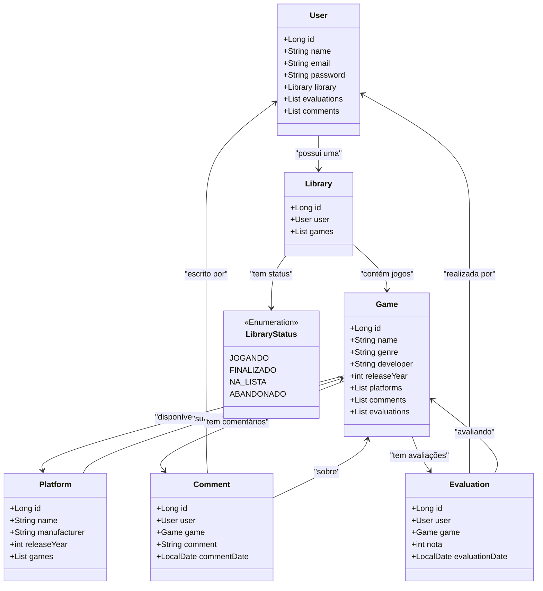

# 🎮 GameHub API

**GameHub API** é uma API REST para o gerenciamento de jogos e plataformas de videogame. Com ela, é possível cadastrar, listar e gerenciar informações sobre jogos e suas respectivas plataformas.

---

## 📌 Diagrama de Classes  

## 🚀 Tecnologias Utilizadas
- Java 21

- Spring Boot

- Spring Data JPA

- H2 Database (ou PostgreSQL/MySQL)

- Swagger para documentação

## 🔥 Funcionalidades
- Listar jogos.
- Adicionar novos jogos.
- Gerenciar plataformas de video game.

## 🛠 Como rodar o projeto
1. Clone este repositório.
2. Abra o projeto na sua IDE preferida.
3. Execute o projeto com o Spring Boot.
4. Acesse `http://localhost:8080/api/games` para testar a API.

## 🤝 Como contribuir
1. Fork este repositório.
2. Crie uma nova branch para sua funcionalidade: `git checkout -b feature/nova-funcionalidade`.
3. Faça suas alterações e commit: `git commit -m 'Adiciona nova funcionalidade'`.
4. Envie para o repositório remoto: `git push origin feature/nova-funcionalidade`.
5. Crie um Pull Request.

## 📜 Licença
Este projeto está sob a licença MIT.
