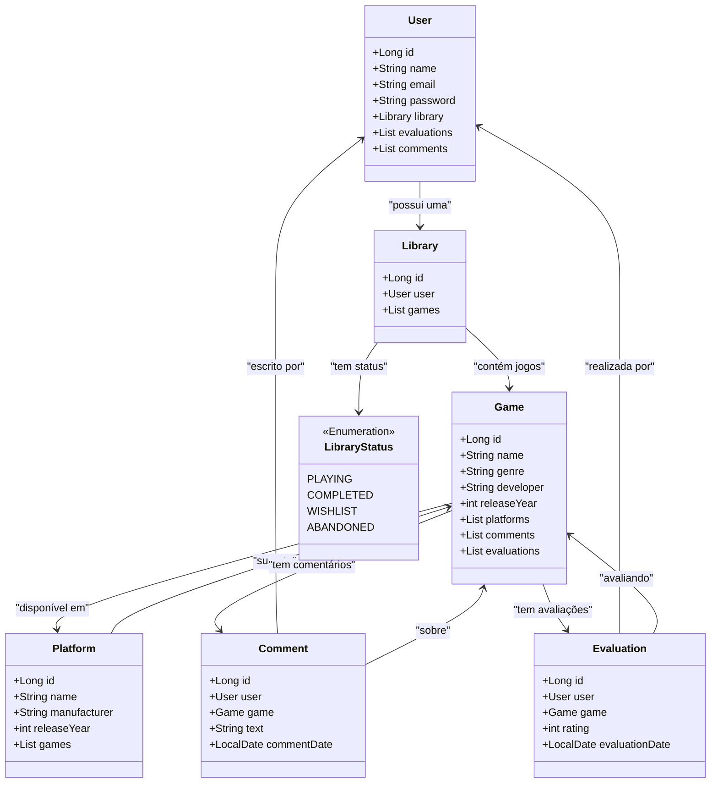

# 🎮 GameHub API

**GameHub API** é uma API REST para o gerenciamento de jogos e plataformas de videogame. Com ela, é possível cadastrar, listar e gerenciar informações sobre jogos e suas respectivas plataformas.

---

## 🚀 Tecnologias Utilizadas

O projeto utiliza tecnologias modernas para garantir alta performance e produtividade:

- **Java 21**: Versão mais recente do Java, aproveitando os recursos mais avançados da linguagem.
- **Spring Boot 3**: Framework que simplifica a criação de aplicações Java, permitindo autoconfiguração e maior produtividade.
- **Spring Data JPA**: Facilita a integração com bancos de dados SQL e simplifica o acesso aos dados.
- **Banco de Dados**: H2 para testes locais e PostgreSQL/MySQL para produção.
- **Swagger (OpenAPI)**: Documentação clara e interativa da API.
- **Railway**: Hospedagem na nuvem com suporte para pipelines CI/CD.

---

## 📌 Diagrama de Classes  



---

## 🔥 Funcionalidades

A API oferece diversas funcionalidades para o gerenciamento de jogos:

- 📋 **Listar jogos** disponíveis no sistema.
- ➕ **Adicionar novos jogos** à biblioteca do usuário.
- 🛠 **Gerenciar plataformas** de videogame.
- ⭐ **Avaliar jogos** com notas e comentários.
- 🏷 **Organizar a biblioteca pessoal** com status como "Jogando", "Finalizado", "Na Lista", etc.

---

## 🛠 Como Rodar o Projeto

### Pré-requisitos:
- Java 21+
- Maven 3.8+
- Banco de dados configurado (H2/PostgreSQL/MySQL)

### Passos:
1. Clone este repositório:
   ```sh
   git clone https://github.com/seu-usuario/gamehub-api.git
   ```
2. Acesse a pasta do projeto:
   ```sh
   cd gamehub-api
   ```
3. Configure o banco de dados no `application.properties`.
4. Compile e execute o projeto:
   ```sh
   mvn spring-boot:run
   ```
5. Acesse a API via navegador ou Postman:
   - **Swagger UI**: [`http://localhost:8080/swagger-ui.html`](http://localhost:8080/swagger-ui.html)
   - **Lista de Jogos**: [`http://localhost:8080/api/games`](http://localhost:8080/api/games)

---

## 📚 Documentação Interativa

Acesse a documentação completa da API em:

🔗 https://gamehub-api.up.railway.app/swagger-ui.html

---

## 🤝 Como Contribuir

Se quiser contribuir para o projeto, siga estas etapas:

1. Faça um fork do repositório.
2. Crie uma nova branch para sua funcionalidade:
   ```sh
   git checkout -b feature/nova-funcionalidade
   ```
3. Faça suas alterações e commit:
   ```sh
   git commit -m 'Adiciona nova funcionalidade'
   ```
4. Envie para o repositório remoto:
   ```sh
   git push origin feature/nova-funcionalidade
   ```
5. Crie um Pull Request para revisão.

---

## 📜 Licença

Este projeto está sob a **Licença MIT**. Você pode usá-lo, modificá-lo e distribuí-lo livremente. Para mais detalhes, consulte o arquivo `LICENSE`.

---

💡 *Dúvidas ou sugestões? Sinta-se à vontade para abrir uma issue ou entrar em contato!* 🚀

