# 🎮 GameHub API

**GameHub API** é uma API REST para o gerenciamento de jogos e plataformas de videogame. Com ela, é possível cadastrar, listar e gerenciar informações sobre jogos e suas respectivas plataformas.

---

## 📌 Diagrama de Classes  

```mermaid
classDiagram
    class User {
        +Long id
        +String name
        +String email
        +String password
        +List<Game> libraryGames
        +List<Evaluation> evaluations
        +List<Comment> comments
    }

    class Game {
        +Long id
        +String name
        +String genre
        +String developer
        +int releaseYear
        +List<Platform> platforms
        +List<Comment> comments
        +List<Evaluation> evaluations
    }

    class Platform {
        +Long id
        +String name
        +String manufacturer
        +int releaseYear
        +List<Game> games
    }

    class Evaluation {
        +Long id
        +User user
        +Game game
        +int nota
        +LocalDate evaluationDate
    }

    class Comment {
        +Long id
        +User user
        +Game game
        +String comment
        +LocalDate commentDate
        +Evaluation evaluation
    }

    %% Relacionamentos organizados
    User --> Game : "possui na biblioteca"
    Game --> Platform : "disponível em"
    Platform --> Game : "suporta"
    Game --> Comment : "tem comentários"
    Game --> Evaluation : "tem avaliações"
    Evaluation --> User : "realizada por"
    Evaluation --> Game : "avaliando"
    Comment --> User : "escrito por"
    Comment --> Game : "sobre"
    Comment --> Evaluation : "referente a"
```

## 🚀 Tecnologias Utilizadas
- Java 21

- Spring Boot

- Spring Data JPA

- H2 Database (ou PostgreSQL/MySQL)

- Swagger para documentação

## 🔥 Funcionalidades
- Listar jogos.
- Adicionar novos jogos.
- Gerenciar plataformas de video game.

## 🛠 Como rodar o projeto
1. Clone este repositório.
2. Abra o projeto na sua IDE preferida.
3. Execute o projeto com o Spring Boot.
4. Acesse `http://localhost:8080/api/games` para testar a API.

## 🤝 Como contribuir
1. Fork este repositório.
2. Crie uma nova branch para sua funcionalidade: `git checkout -b feature/nova-funcionalidade`.
3. Faça suas alterações e commit: `git commit -m 'Adiciona nova funcionalidade'`.
4. Envie para o repositório remoto: `git push origin feature/nova-funcionalidade`.
5. Crie um Pull Request.

## 📜 Licença
Este projeto está sob a licença MIT.
